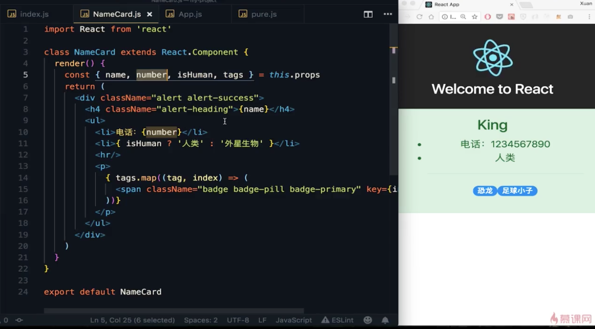

# iMooc：基于实例的 React16 傻瓜课程

课程：<https://www.imooc.com/learn/1045>

## 第一章 进入React 的世界

### 1-1 React 简介

**React 特点：**

* 声明式的写法
* 组件化
* 一次学习，随处编写
* 大厂加持：Facebook
* 最流行，使用人数最多，最被开发者喜爱
* 简单易懂

### 1-2 配置开发环境（1）

官方脚手架工具 create-react-app
* `npm install create-react-app -g`
* 不需要任何配置
* 包含测试框架
* `create-react-app my-project` 创建项目

### 1-3 配置开发环境（2）

* `npm start` 启动本地开发环境
* 浏览器自动开启

### 1-4 React 第一个组件

* Render 方法
* ReactDOM.render 方法

## 第二章 JSX

### 2-1 JSX第一部分

* JSX 是 Javascript 的语法扩展
* 花括号内可以直接写任何 js 表达式
* JSX 也是一种表达式
* JSX 属性特例：html中 class 使用 className
* JSX 属性特例：html中 for 使用 htmlFor

### 2-2 JSX第二部分 (05:03)

JSX 经过 Babel 编译后支持低版本的浏览器

## 第三章 React 属性

### 3-1 React 属性

Props （属性）
* 组件的函数写法
* 属性是只读的，不能修改

### 3-2 React 状态 

State 状态
* 状态 State 是可以动态改变的
* state 是组件私有的
* this.setState() 更新状态的唯一方法

